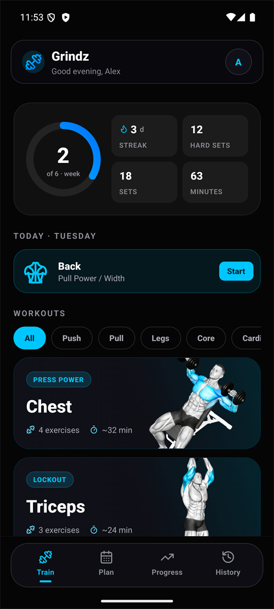

 

---

## About

Final year undergraduate at IIT Madras, working on systems that put language models to real work rather than demos.

Most of my time goes to two things. Building agentic workflows where a model has tools, state and a verification loop instead of a single prompt. And real time voice, where a model has to hold a conversation inside a latency budget that does not forgive mistakes.

I have production experience building real time voice systems, including live call audio pipelines that feed AI agents. That work sits in private repositories, so this profile shows the public side.

---

## Focus areas

| Area | What that means in practice |
|---|---|
| **Agentic AI workflows** | Giving models tools, memory and a verification step. Making the loop reliable enough that the output can be trusted without reading every line. |
| **Voice AI** | Streaming speech pipelines for real time conversation. Turn detection, interruption handling, and keeping response latency low enough to feel natural. |
| **Applying LLMs to real problems** | Evaluating where automation actually holds up, and where it quietly fails. Building the harness before trusting the model. |

---

## grindz

<table>
<tr>
<td width="260" valign="top">

</td>
<td valign="top">

A training log with a muscle map that shows exactly what you worked this week. Every muscle is shaded by what you actually trained so a group you keep skipping is impossible to miss.

Shipped as a React Native Android app and an installable PWA against one Supabase backend. Free and no ads.

- **Muscle heat map.** Traced vector figures with every muscle individually addressable. Shaded by what you actually hit this week.
- **Progression memory.** Last time and your best sit right where you are about to type. PRs get detected as they happen.
- **Live sessions.** Sets as kg by reps with a running timer. RPE captured on the set you just finished.
- **16 week history.** Streaks and a contribution style heatmap so a skipped week has nowhere to hide.
- **Two clients one backend.** Android APK and an installable PWA against the same Supabase schema.

  

  
  
  

</td>
</tr>
</table>

---

## Trying to learn

Working through the fundamentals alongside building.

---

## Tech

**Languages**

**Web and mobile**

**Data**

**Tooling and infrastructure**

---

## Other work

**kamar-taj** is agent tooling for Claude Code. Three skills aimed at a specific failure mode: one turns a day of AI assisted work into a readable study guide, one refuses to call a bug fixed until it has watched the test pass, and one sends the work to a second model to argue against it. Starred by developers outside my network.

**Lodestar** is a study tracking system with a React and Vite dashboard plus an Expo Android client on a shared Supabase backend.

---

## Activity

  

  

---

## Contact

