 

---

## About

Final year undergraduate at IIT Madras, working on systems that put language models to real work rather than demos.

Most of my time goes to two things. Building agentic workflows where an LLM has tools, state and a verification loop instead of a single prompt. And real time voice, where a model has to hold a conversation over a phone line inside a latency budget that does not forgive mistakes.

I have production experience with telephony infrastructure: FreeSWITCH dialplans, SIP trunking, WebRTC and Verto signalling, codec negotiation between G.711 and Opus, call supervision, and forking live call audio into AI agents. That work sits in private repositories, so this profile shows the public side.

---

## Focus areas

| Area | What that means in practice |
|---|---|
| **Agentic AI workflows** | Giving models tools, memory and a verification step. Making the loop reliable enough that the output can be trusted without reading every line. |
| **Voice AI and telephony** | Streaming speech pipelines over SIP and WebRTC. Turn detection, barge in, codec negotiation, and keeping a conversational turn under budget. |
| **Applying LLMs to real problems** | Evaluating where automation actually holds up, and where it quietly fails. Building the harness before trusting the model. |

---

## Real time voice agent pipeline

The architecture I work in and keep rebuilding. The interesting engineering is not the model call. It is everything around it that has to happen inside roughly 800 milliseconds.

Two things dominate the budget and neither is speech processing. Turn detection has to decide the caller actually stopped talking, and the model has to produce its first token. Everything else is streaming and can be overlapped.

---

## Core CS foundations

Currently working through the fundamentals in parallel with building.

---

## Tech

 

  

---

## Selected work

### [kamar-taj](https://github.com/ShockRock2004/kamar-taj) &nbsp;·&nbsp; Python

Agent tooling for Claude Code. Three skills that address a specific failure mode of coding agents: one turns a day of AI assisted work into a readable study guide, one refuses to call a bug fixed until it has watched the test pass, and one sends the work to a second model to argue against it.

Built because reviewing agent output by reading every diff does not scale. Starred by developers outside my network.

### [grindz](https://github.com/ShockRock2004/grindz) &nbsp;·&nbsp; TypeScript

A workout tracker running as a React Native Android app and an installable PWA against one Supabase backend and an image CDN. Shipped to a real device with a signed APK, which is where the interesting bugs live.

### [Lodestar](https://github.com/ShockRock2004/Lodestar) &nbsp;·&nbsp; JavaScript

A study tracking system with a React and Vite dashboard plus an Expo Android client on a shared Supabase backend.

---

## Activity

  

---

## Contact

