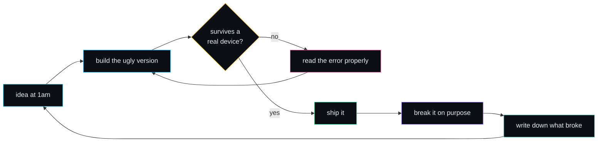

 

 

---

## `whoami`

---

## `the arsenal`

Everything below has shipped something. Nothing on this list is aspirational.

 

 

 

---

## `honest numbers`

Two charts. The left one is what I can do. The right one is what I am doing about the gaps.

<table>
<tr>
<td></td>
<td></td>
</tr>
</table>

---

## `how my projects are wired`

Every project turns into the same shape. One source of truth. Everything else is a client.

And the loop that keeps producing it.

---

## `flagship builds`

<table>
<tr>
<td>

</td>
<td>

</td>
</tr>
<tr>
<td>

</td>
<td>

</td>
</tr>
</table>

| repo | what it really taught me |
|---|---|
| **[grindz](https://github.com/ShockRock2004/grindz)** | A workout tracker I use every session. Real devices surface bugs a simulator never will. |
| **[kamar-taj](https://github.com/ShockRock2004/kamar-taj)** | Claude Code skills I built because I was tired of not having them. Four strangers starred it. |
| **[Lodestar](https://github.com/ShockRock2004/Lodestar)** | A study tracker I actually use. Shipping to yourself is the fastest feedback loop there is. |
| **[news-intelligence](https://github.com/ShockRock2004/news-intelligence)** | Mostly an excuse to stop being scared of Docker. It worked. |

---

## `the trail`

The early repos are still public on purpose. Deleting them would be editing the story and the gap between those and the current ones is the only progress report that matters.

---

## `by the numbers`

  

  

  

  

---

## `find me`

